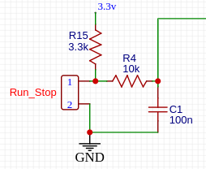
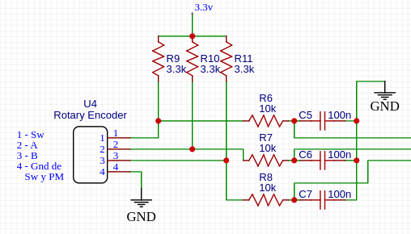

# <center>MicroPython Library</center>

## Key Features:
These library modules are designed using POO to facilitate the management of common devices in electronics projects using microcontrollers GPIO, programmed in MicroPython.
Its design relies on a compact isr code, and external user defined callbacks to handle the irq events.

## Electronic design Requirements
### Low-Pass filters and Pull-Up/Down resistors
While these libraries were created with simplicity and efficiency in mind, they do not include code to prevent bouncing in buttons, encoders, and other devices susceptible to this problem. It is well known that much better solutions exist for these problems using electronic components, such as low-pass filters and schmitt-triggers to prevent bounce, for example.
Another design concept is the decision to base the function of the controllers on the use of external pull-up/pull-down resistors on the GPIO pins, to give projects greater design flexibility.

## Project Structure
This library is made by modules. Each module contains the classes needed to drive a single device.
The documentation of each class is written in the module file.  
The main characteristics of the modules of this library, are shown below

## Classes

### Button
Class to manage short and long clicks events on buttons connected to a GPIO microcontrollers
#### Main features
>* Irq driven
>* Trigger on high or low value
>* Normal Close or Normal Open buttons
>* Detect short or long clicks (Long click duration specified in the instantiation)
>* Uses an external (outside ISR context) user callback
>* No limit for the external user callback

### Encoder
Class to manage mechanical quadrature rotary encoders connected to GPIO microcontrollers
#### Main features
>* Irq driven
>* Detects clockwise and counter-clockwise rotation, and passes the direction to an external (outside the ISR context) user callback
>* No limit for the external user callback
### Oled1306I2c
Class to manage the oled 1306 with I2C interface
The class is a subclass of the existent SSD1306_I2C class
#### Main features
Helps and make very easy to display lines and chars on the oled
Implements controls to avoid overwrites of data
### Menu
Manages menu structures for OLED displays with no limit on the number of menus or submenus.
There is a limit in the amount of Items of a menu, which is determined by the OLED display size.
The class will raise an exception if the menu structure exceeds the display capacity.
### Data-input-encoder
Manages the input of values from a rotary encoder and an OLED display.
It accepts floating points numbers, strings, Yes/No fields and selecting a string from a list of strings.
The class, manages the field input with a prompt and a formatted value.
It allows specifying low and high limit for numbers.
Values are defined by rotary encoder using step-up and step-down values. The class uses a structure where all the parameters are defined for each field

### ButtonException, I2cException, OledException, MenuException, InputException
Customized Exception for different classes in this library

## Examples
### Button
```Python
from button import Button

MyButton = Button(4,500,Button.ACTIVE_HIGH, buttonpressed)
# button pin = 4
# Long click duration in ms = 500
# button activates on high value
    
def buttonpressed(longClick):
    if longClick == Button.LONG_CLICK:
       print('Long Click Detected')
    else:
       print('Short Click detected')
```
### Encoder
``` Python
    from encoder import Encoder

    Miencoder = Encoder(4,5,rotation)

    def rotation(direction):
        if direction == Encoder.CLOCKWISE:
            print('clockwise rotation detected')
        else:
            print('counterclockwise rotation detected')

```
### Oled1306I2c
``` Python
from oled1306I2c import Oled1306I2c
from machine import Pin, SoftI2c
I2c = SoftI2c(sda_pin = Pin(10), scl_pin = Pin(11))
myOled = Oled1306I2c (I2c)

myOled.write_lines(((1,'linea 1'), (2, 'linea 2')))
myOled.delete_lines(1,2)
myOled.write_chars(line, col, 'xy')
myOled.delete_chars(line, col, num_of_chars)
myOled.clear_screen()
```
### Menu
```Python
    from menu import Menu
    from oled1306I2c import Oled1306I2c
    from machine import Pin, SoftI2c
    from encoder import Encoder
    from button import Button

    def muestra_algo(menu, item):
    print(f'hizo click en menu {menu} item {item}')
    menu = (
            ('Electr. Charge',   # menu #1
                (
                    (2,'Setup Values', 2, None, 'Click to enter', True),
                    (3,'Run/Stop', 0, muestra_algo, 'Run/Stop charge', True)
                ),
            ),
            (   # menu #2
                'Set Parameters',
                (
                    (2,'Set Current', 0, None, 'Current value', True),
                    (3,'Set Power', 0, None, 'Power value', True),
                    (4,'Set Resistance', 0, None, 'Resistance value', True),
                    (5,'Set min Voltage', 0, None, 'Low Volt Value', True),
                    (6,'Set time limit', 0, None, 'Run Time Limit', True),
                    (7,'Return', 1, None, 'Main Menu', True),
                )
                )
    )
    def set_cursor_position(direction):
        if direction == Encoder.CLOCKWISE:
            Main_menu.next_item()
        else:
            Main_menu.previous_item()
    def execute_item(long_short_click: int) -> None:
        if long_short_click == Button.SHORT_CLICK:
            Main_menu.execute_item()
        else:
            Main_menu.previous_menu()
    callback_encoder: callable = set_cursor_position
    callback_button: callable = execute_item
    e = Encoder(4,5,callback_encoder)
    b = Button(6, 400, 0, callback_button)
    I2c = SoftI2c(Pin(0), Pin(1))
    oled = Oled1306I2c(I2c)
    Main_menu = Menu (oled, menu)
    Main_menu.show()
    Main_menu.select_item()
    while True:
        pass


```
### Data_input_encoder
```Python
from micropython import const
from machine import Pin, SoftI2C
from encoder import Encoder
from button import Button
from oled1306I2c import Oled1306I2c
from data_input import Data_input_encoder
import time

pin_oledClock: int = const(1)
pin_oledData: int = const(0)
pin_encoderA: int = const(4)
pin_encoderB: int = const(5)
pin_button: int = const(6)

oledData = Pin(pin_oledData, Pin.IN, Pin.PULL_UP)
oledClock = Pin(pin_oledClock, Pin.IN, Pin.PULL_UP)
i2c_oled = SoftI2C(sda=oledData, scl=oledClock, freq=400_000)
oled = Oled1306I2c(i2c_oled, 128, 64)

# Callbacks
# Encoder callbacks functions for the different types of fields
def encoder_callback_num(direc: int) -> None:
    if direc == encoder.CLOCKWISE:
        iFields.step_up()
    else:
        iFields.step_down()

def encoder_callback_list(direc: int) -> None:
    if direc == encoder.CLOCKWISE:
        iFields.list_up()
    else:
        iFields.list_down()

def encoder_callback_yesno(direc: int) -> None:
    iFields.toggle_yes_no()

def encoder_callback_dummy (direc: int) -> None:
    pass

# Set the encoder callback depending on the type of the field selected
def set_encoder_callback(field) -> None:
    if fields[field-1]['data_type'] == Data_input_encoder.YES_NO:
        encoder.set_callback(encoder_callback_yesno)
    elif fields[field-1]['data_type'] == Data_input_encoder.NUMBER:
        encoder.set_callback(encoder_callback_num)
    elif fields[field-1]['data_type'] == Data_input_encoder.LIST:
        encoder.set_callback(encoder_callback_list)
    else:
        encoder.set_callback(encoder_callback_dummy)

# Button callback
def button_callback(click_type: int) -> None:
    global field
    if click_type == Button.SHORT_CLICK:
        iFields.set_values()
        field = field + 1 if field < len(fields) else 1
        iFields.set_item(field)
        iFields.prompt()
        set_encoder_callback(field)
    else:
        for field in range(len(fields)):
            iFields.set_item(field)
            iFields.clear_values()
            iFields.set_values()
            iFields.prompt()
        field = 1
        iFields.set_item(field)
        iFields.prompt()
        set_encoder_callback(field)

# input fields definition
# In this example, a structure with 3 fields are defined.
# Each field has its parameters in a dictionary
# The structure passed to the constructor of the class is a tuple with a dictionary for each field needed
fields: tuple[dict, ...] = (
    {
        "data_type": Data_input_encoder.NUMBER, # field type
        "coord": (1, 13),                       # coordinates of the input field
        "prompt": ("Current:", 1, 1),           # prompt and its coordinates
        "format": "4.2f",                       # format of field display
        "limits": (0, 1),                       # upper and lower limit of numeric fields
        "step_up": .1,                          # Amount to increase en each rotary click
        "step_down": .01,                       # Amount to decrease en each rotary click
        "list": (),                             # tuple os strings to select in list fields
        "value": 0.0                            # Stored value of the field
    },
    {
        "data_type": Data_input_encoder.LIST,
        "coord": (3, 11),
        "prompt": ("Tipo:", 3, 1),
        "format": ">6",
        "limits": (0, 0),
        "step_up": 0,
        "step_down": 0,
        "list": ('coca', 'fanta', 'pomelo', 'sprite'),
        "value": 1                              # In list fields, it is the position of the element selected, starting in 1
    },
    {
        "data_type": Data_input_encoder.YES_NO,
        "coord": (5, 11),
        "prompt": ("Run/Stop:", 5, 1),
        "format": "",
        "limits": (0, 0),
        "step_up": 0,
        "step_down": 0,
        "list": (),
        "value": 0      # 0 = No selected, 1 = Yes selected
    }
)

button = Button(pin_button, callback=button_callback, upDown=Button.ACTIVE_LOW, longClick_ms=0)
button.disable()
encoder = Encoder(pin_encoderA, pin_encoderB, encoder_callback_num)
encoder.disable()
iFields = Data_input_encoder(oled, fields)
field: int = 1
set_encoder_callback(field)
encoder.enable()
iFields.set_item(field)
iFields.prompt()
button.enable()

while True:
    pass
```
## Hardware Design
### Buttons
Recommended hardware connection for buttons.
Low-Pass filter and Pull-up is needed
It is recommended a schmitt-trigger as well

### Rotary encoders
Recommended hardware connection for mechanical rotary encoders.
There is Low-Pass filters and Pull-Up resistors in each GPIO pins
It is recommended a schmitt-trigger as well

### OLED displays
>**For OLED displays using ssd1306 modules only**
Some OLED displays use ssd1306 classes and others sh1106. This class is designed for using with ssd1306 modules. An upgrade is comming to includ other OLED types

### Exceptions
The exceptions.py module contains Exception classes to personalize exceptions for each class in this library 
***
## Library Compatibility
This library's modules were tested in a real hardware, based on a RP2040 Zero, but no changes are needed to run in other `MicroPython-based microcontrollers`

## Limitations
* No code for debouncing are implemented
* No embedded GPIO Pull-Up/Down are implemented in GPIO pins
* Designed exclusively for MicroPython-based microcontrollers

## Installation
Copy the .py file of the module(s) needed to the /lib folder of the microcontroller file system
See the examples above

## Upcoming Improvements
There are modules to be added to this library, such as:
* Ina219 Volt and current sensor module class
* ZMPT101B voltage sensor module class
* Support for other OLED modules

## License

MIT license